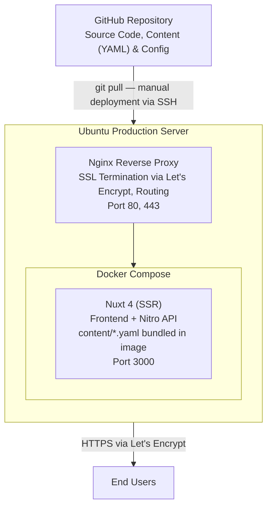

# kmapper.ch

## Architecture

Content (page copy, SEO metadata) lives as YAML files under `frontend/content/`, and UI labels live under `frontend/i18n/locales/`. Both ship with the frontend image, so content changes go through the same git workflow as code.

## Local Development

1. `docker compose up -d`
   - Access localhost:3000 for the frontend

## Prod Deployment

### Frontend

1. SSH into the server
1. `cd /opt/kmapper.ch`
1. Pull latest code with `git pull`
1. Rebuild and restart the frontend container with `docker compose -f docker-compose.prod.yml up -d --build frontend`
1. Clear build cache with `docker builder prune -f`

### Environment Variables

1. From the project root: `scp .env.prod kmapper-vps:/opt/kmapper.ch/.env`

### Backup Kanboard

1. From the project root (kmapper.ch): `rsync -avz kmapper-vps:/opt/kmapper.ch/kanboard/data/db.sqlite ./kanboard/db.sqlite`

The custom CSS is also backed up separatly in `/kanbaord`.
