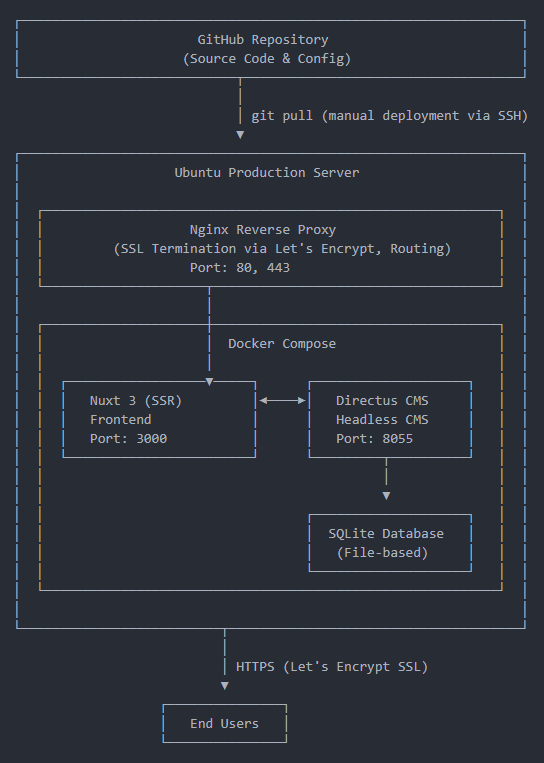

# kmapper.ch

## Architecture

Based on this little fullstack: https://github.com/cyrill-martin/my-little-fullstack

## Local Development

1. docker compose up -d
   - Access localhost:8055 for Directus
   - Access localhost:3000 for the frontend

## Prod Deployment

### Frontend

1. SSH into the server
1. `cd /opt/kmapper.ch`
1. Pull lates code with `git pull`
1. Rebuild and restart the frontend container with `docker compose -f docker-compose.prod.yml up -d --build frontend`
1. Clear build cache with `docker builder prune -f`

### Directus (config/extensions)

1. SSH into the server
1. `cd /opt/kmapper.ch`
1. Pull lates code with `git pull`
1. Rebuild and restart the directus container with `docker compose -f docker-compose.prod.yml up -d --build directus`
1. Clear build cache with `docker builder prune -f`

### Environment Variables

1. SSH into the server
1. `cd /opt/kmapper.ch`
1. Edit .env with `nano .env`
   - Ctrl + o
   - Enter
   - Ctrl + x
1. Restart affected container(s)

### Database

#### Replace Prod with Local Data

1. Stop Directus on Prod with:
   1. SSH into the server
   1. `cd /opt/kmapper.ch`
   1. `docker compose -f docker-compose.prod.yml stop directus`
1. Go to your local dev directory
1. Copy the database to Prod with `rsync -avz ./directus/database/data.db infomaniak-vps:/opt/kmapper.ch/directus/database/data.db`
1. Copy and sync the uploaded files with `rsync -avz --delete ./directus/uploads/ infomaniak-vps:/opt/kmapper.ch/directus/uploads/`
1. (Optionally deploy the new fronten (see above))
1. Restart the stack on Prod with `docker compose -f docker-compose.prod.yml up -d`
1. Update the preview URLs in Directus (solve THIS)
1. Clear build cache with `docker builder prune -f`
